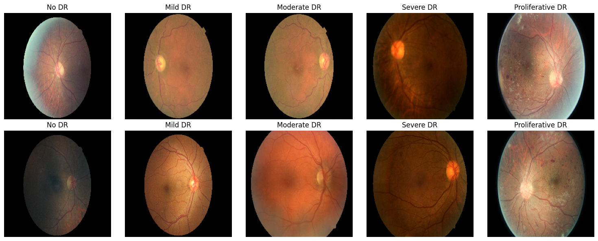
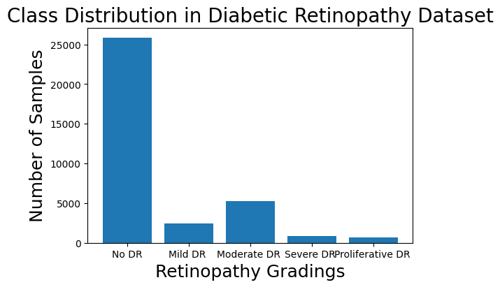
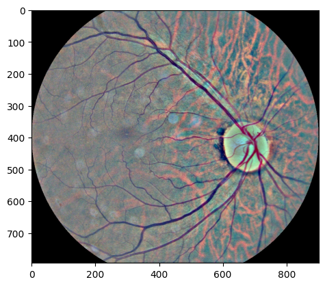
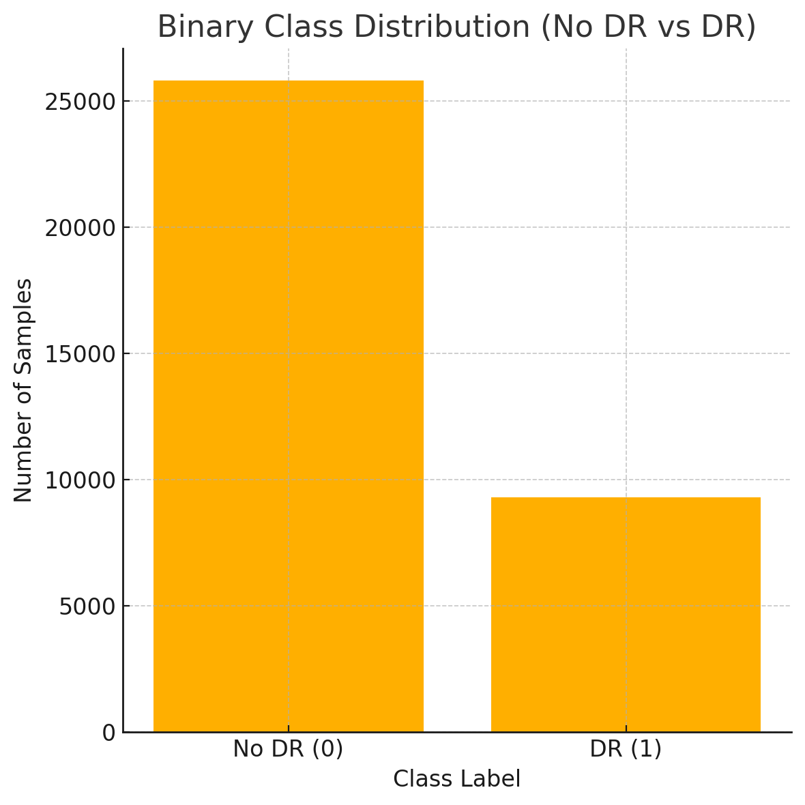
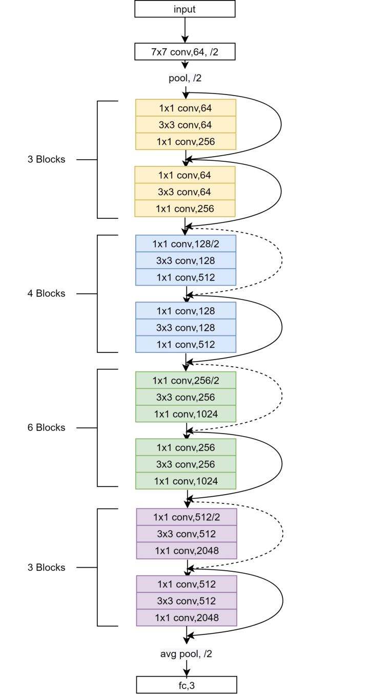
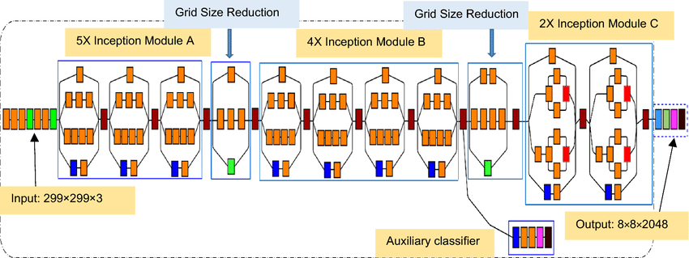
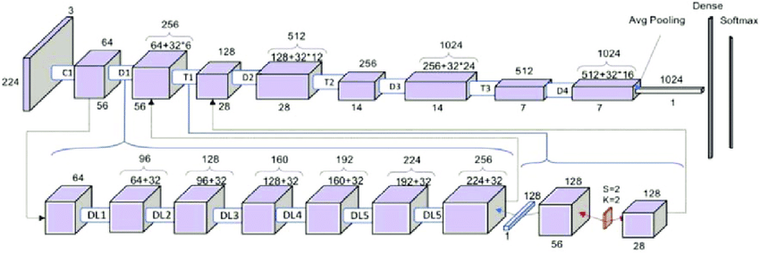

## A Comparative Study on Multi-Stage Fine-Tuning Approaches for Diabetic Retinopathy Detection

**Diabetic Retinopathy (DR)** is the leading cause of preventable blindness and is projected to affect up to 700 million people by 2045. Diabetic retinopathy is a complication of diabetes mellitus that affects the blood vessels of the retina. If left undetected, it can lead to vision impairment or even blindness. Early diagnosis is crucial, and deep learning models have shown promise in assisting automated detection from retinal images. This project explores a deep learning approach to enable early and accurate detection.

### Motivations for this project
- I've been highly interested in the field of deep learning and its applications within the medical field.
- Patients today often face delays in diagnosis due to limited access to specialists and time-consuming manual screening processes. Automated detection systems like the one proposed in this project can help accelerate diagnosis, reduce workload on medical professionals, and potentially improve early intervention outcomes.


---

## Table of Contents

1. [Dataset](#dataset)
   - [Structure](#structure)
2. [Exploratory Data Analysis (EDA)](#exploratory-data-analysis-eda)
   - [Class Distribution](#class-distribution)
   - [Preprocessing](#preprocessing)
   - [Data Augmentation](#data-augmentation)
3. [Modeling Approach](#modeling-approach)
   - [Model architectures](#model-architectures)
   - [Fine-Tuning Strategies](#fine-tuning-strategies)
4. [Training Details](#training-details)
   - [Loss Function](#loss-function)
   - [Optimizer and Scheduler](#optimizer-and-scheduler)
   - [Early Stopping and Checkpoints](#early-stopping-and-checkpoints)
5. [Results](#Results)
6. [Conclusion](#conclusion)
7. [Future Work](#future-work)
8. [How to Run the Project](#how-to-run-the-project)


---

## Dataset

The dataset used in this project is known as the **EyePACS dataset**, provided by Will Cukierski in the [2015 Kaggle competition](https://www.kaggle.com/c/diabetic-retinopathy-detection). It contains high-resolution retinal images labeled by DR severity levels ranging from 0 (No DR) to 4 (Proliferative DR).

All images were taken from patients and include both the left and right eye. Some images were noisy or low contrast. The steps taken in the [preprocessing section](#preprocessing) explain how these issues were addressed.

### Structure

The dataset consists of a zip file containing all training and testing examples. However, due to the test set having private labels, we opted to only use the training images as our full dataset. The training folder contains 35,126 images with labels, which were used for training and evaluation in this study.

## Exploratory Data analysis

35,126 images are present in the dataset. There are 5 severity gradings from No DR - Proliferative DR, No-dr has the highest prevalence with 73% of the dataset being healthy(No DR). To mitigate this we turned the study into a 2 class problem to handle the large imbalance. Data augmentation techniques seen in the following sections helped to improve generalizability. 

Image below shows 2 sets of original training images across all severity gradings




### Class Distribution 


### Preprocessing


As images contained large Black borders which contains irrelevant information that can alter the way a deep neural network extracts relevant information, we implemented a cropping algorithm with a threshold value which aims to only capture the retina from each image.
Consistent sizing of the images were something the authors did not handle therefore images were scaled to ensure the network sees a consistent input. 

The images provided by the authors were taken under poor lighting conditions which made the blood vessels and other symptoms of DR difficult to notice. High boost filtering was used to enhance the contrast of retinal images, making subtle features such as microaneurysms, hemorrhages, and blood vessels more prominent for improved detection. See ['DR.pdf](./Paper/DR.pdf) for in depth reasoning.[`black_images.py`](./Scripts/black_images.py)was ran however there were no fully black images in the original dataset. 


1. Run [`preprocess_2.py`](./Scripts/preprocess_2.py) on the original training images – output will be a directory of preprocessed images.  
2. Run [`convert_to_binary_classification.py`](./Scripts/convert_to_binary_classification.py) on the original CSV to transform all labels to either 0 or 1 (No DR vs DR).


An single output image after preprocessing should look like the below




### Data Augmentation
Online Data augmentation was used to allow the model to see variations of each image per EPOCH, this allows for better generalizability and essentially mitigates the problem of having to oversample and store more images on the hard disk. 

The data augmentation used was 
- Random Horizontal flio
- Random Rotation
- Random Vertical Flip
- Standardization was done on the train set giving a mean of 0 and unit variance of 1


After all the preprocessing steps, you should end up with a new dataset. 
<p align="center">
  
</p>


## Modelling Approach
Three pretrained architectures were used preventing us from training the model from scratch with random weights and biases. 
Inception v3, ResNet50 and DenseNet121 were used, all 3 architectures were modified in which Dropout layers, Activation functions and a Classifier layer were added, This was added to the improve generalizability and also map the feature maps to our 2 classes. The ["DR.pdf"](./Paper/DR.pdf) goes in depth explaining the reasoning for these modifications and the parameters used. 

We trained these models using an A100 GPU provided by colab pro. 

### Model architectures

<table>
  <tr>
    <td align="center">
      <br/>
      <strong>ResNet50</strong>
    </td>
    <td align="center">
      <br/>
      <strong>InceptionV3</strong>
    </td>
    <td align="center">
      <br/>
      <strong>DenseNet121</strong>
    </td>
  </tr>
</table>


### Fine-Tuning Strategies
Instead of training the model from scratch, we leveraged Transfer learning which allowed us to transfer the knowledge gained from one domain(image net) to ours. This meant the pretrained parameters were used however optimized for our Task at hand. All 3 networks underwent consistant modifications instead of Inception v3 which already contained a Dropout layer. Networks were trained using a multi-stage process in which the classifier head was trained for N epochs to prevent initial weight distortion then all layers were set to trainable. With trial and error of different methods, this yielded the best results.

Slight overview

- Transfer Learning: Used pretrained weights from ImageNet to avoid training from scratch, which reduced training time and improved convergence.
- Domain Adaptation: Fine-tuned the pretrained models specifically for retinal image classification, adjusting parameters to our binary DR task.
- Multi-Stage Training:
First stage: Trained only the classifier head to avoid disrupting pretrained feature representations.
Second stage: Unfroze all layers and fine-tuned the entire network to adapt low-level features to our dataset.
- Architecture Adjustments: Added dropout layers and fully connected heads (except for InceptionV3 which already includes dropout) to improve generalization and reduce overfitting.
- Empirical Tuning: Found this strategy to outperform other methods through trial-and-error experiments.


### Training Details
we used a Train/val/test split of 70/15/15, this yielded into a 1:3 ratio between DR and No DR hence the large imbalance across severities were dramatically reduced. The 1:3 also has slight imbalance which was solved by using a weighted loss.
The hyperparameters used and their corresponding values are found in the ["fine-tune-pipeline.ipynb](./src/Models/Fine-tune-pipeline.ipynb)

## Loss Function
Weighted Categorical Cross Entropy was used which allowed us to assign weights to the 2 classes.

- Higher weight was given to the less dominant class (DR)
- The higher weight meant a misclassification in any DR instance led to a larger loss, the network learns over time to place more importance on them. 

## Optimizer and scheduler

- ADAM optimizer
- ReduceLROnPlatue scheduelr, after N epochs of no improvement, the LR is reduced by some factor in hope of finding a new minima. 


## Early Stopping
Custom Early stopping was used with a patience of 10, This prevented overtraining and overfitting to the train set.


### Results 
 DenseNet121 slightly outperformed the others with an accuracy of 89% and the highest AUC score of 0.8694, indicating stronger overall classification performance.

 ## Validation and Test Results

| Model        | Accuracy (%) |   AUC   | Precision (DR) | Recall (DR) |
|--------------|---------------|--------|----------------|-------------|
| ResNet50     | 88            | 0.8591 | 0.77           | 0.80        |
| InceptionV3  | 88            | 0.8550 | 0.77           | 0.80        |
| DenseNet121  | 89            | 0.8694 | 0.78           | 0.82        |


## Conclusion
This project highlights how transfer learning and fine-tuning of deep learning models can effectively detect Diabetic Retinopathy from retinal images. DenseNet121 achieved the best overall performance, demonstrating the value of combining robust preprocessing with pretrained architectures.


## Future Work
- Extend to multi-class classification for detailed DR grading
- Add explainability tools like Grad-CAM for visual insights
- Evaluate on external clinical datasets for better generalization
- Deploy as a simple web application for practical use


## How to run the project 
1. **Clone the Repository**
   ```bash
   git clone https://github.com/Ajama0/Diabetic-Retinopathy-Detection.git


2- **Download the Dataset**
- Go to the [2015 Kaggle competition](https://www.kaggle.com/c/diabetic-retinopathy-detection)
- Download the train folder and trainLabels.csv.
- Place both in the root directory of the cloned project.

3 - **Create a .env file in the project root with the following contents:**
- DR_IMAGES_PATH =./train
- DR_LABELS_PATH=./trainLabels.csv


4 **Run Preprocessing Scripts**

BEFORE running the script add a path in your root directory that Will store the output of ['preprocess_2.py'](./Scripts/preprocess_2.py)

in the env file you should add 
PREPROCESSED_IMAGES = "/yourpath"


Run the following scripts locally:
- ['preprocess_2.py'](./Scripts/preprocess_2.py) – cleans and preprocesses the raw images
- ['convert_to_binary_classification.py'](./Scripts/convert_to_binary_classification.py) – converts DR grades into binary labels (0 = No DR, 1 = DR)


These scripts will generate:
- A new folder: Preprocessed_images/
- A new CSV file: binary_classification.csv


**Zip the Project**
Once preprocessing is complete, zip the entire project folder.
- Ensure that Preprocessed_images/ and binary_classification.csv are included.
- You do not need to include the original train folder or trainLabels.csv.
- Upload to Google Colab
- Upload the zipped project to your Google Drive.


**Run the Notebook**
- Open the ['Fine-tune-pipeline.ipynb](./src/Models/Fine-tune-pipeline.ipynb) included in the project.
- Set the Colab runtime to GPU (Runtime > Change runtime type > GPU). and choose the A100 GPU
- Run all cells in order.


**Model Outputs**
The best model weights for each architecture (ResNet50, InceptionV3, DenseNet121) will be automatically saved to your Google Drive during training.


